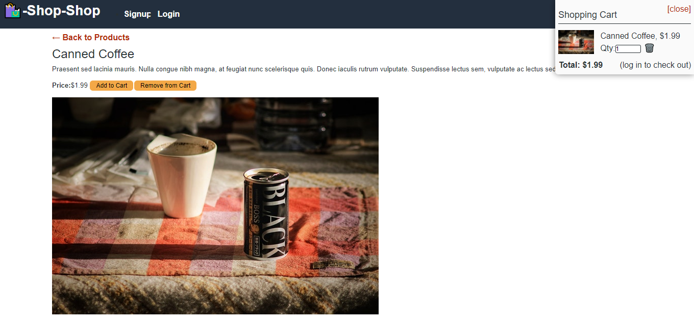
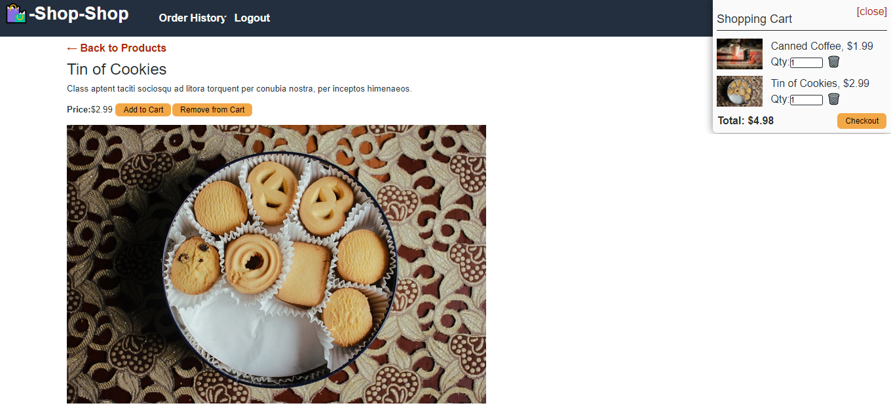
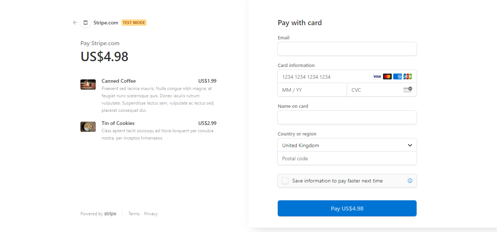
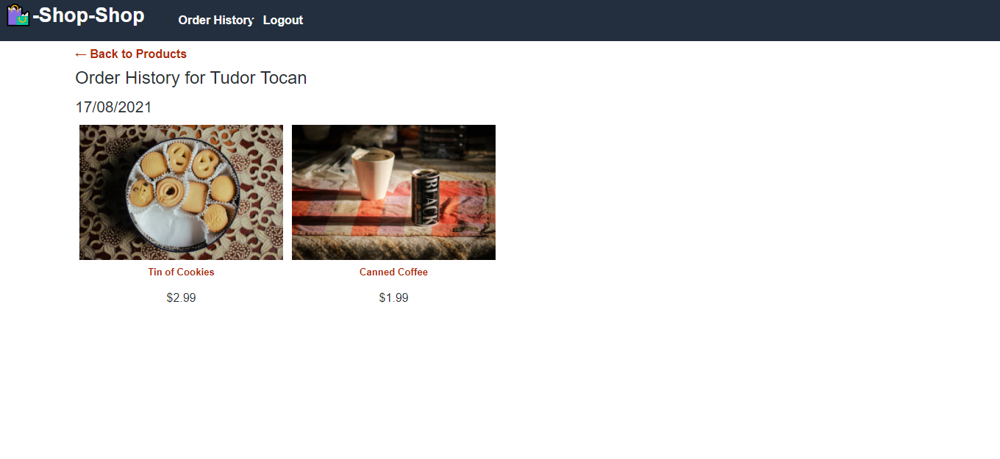

# E-Commerce Redux

## Table of contents

- [E-Commerce Redux](#e-commerce-redux)
  - [Table of contents](#table-of-contents)
  - [Description](#description)
  - [User Story](#user-story)
  - [Screenshots](#screenshots)
  - [Deployed Link](#deployed-link)
  - [Github Repository](#github-repository)

## Description

A full Stack Application that allows the user to search for products from an online store, and using Stripe, to buy them. It is running a GraphQL and Apollo back-end and a React-Redux front-end.

## User Story

```md
GIVEN an e-commerce platform that uses Redux to manage global state
WHEN I review the app’s store
THEN I find that the app uses a Redux store instead of the Context API

WHEN I review the way the React front end accesses the store
THEN I find that the app uses a Redux provider

WHEN I review the way the app determines changes to its global state
THEN I find that the app passes reducers to a Redux store instead of using the Context API

WHEN I review the way the app extracts state data from the store
THEN I find that the app uses Redux instead of the Context API

WHEN I review the way the app dispatches actions
THEN I find that the app uses Redux instead of the Context API
```

## Screenshots

Signup Page


All Products Page


Logged Out Product Page


Logged In Product Page


Checkout Page


Order History


## Deployed Link

You can access the deployed link of this application by clicking [here](https://shielded-beyond-00024.herokuapp.com/)

## Github Repository

You can access the GitHub repository by clicking [here](https://github.com/ttudorandrei/redux-store)
